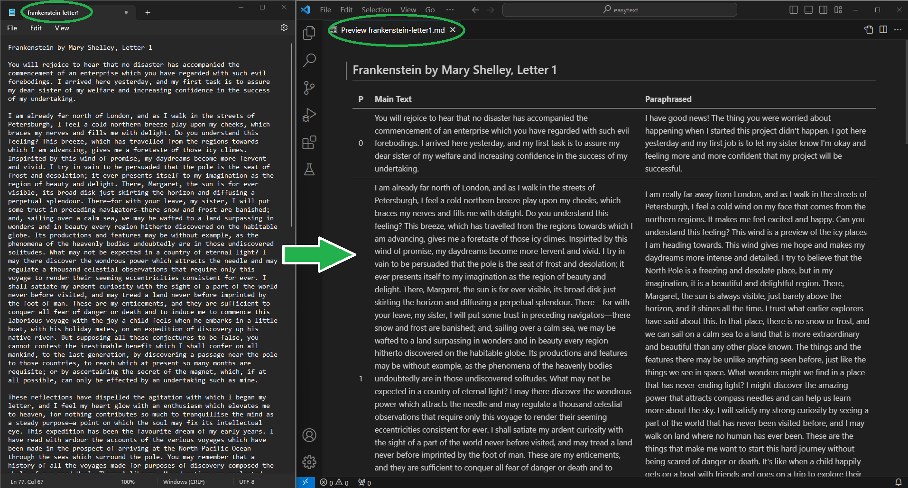

# easytext.py

A simple python script to quickly create adapted versions of texts (plain language, paraphrased, reduced reading level) using OpenAI's API.  

## Description

* Providing adapted texts is an educational practice grounded in the SIOP Model, Krashen's Theories, and UDL.  See Educational Rationale section below for more information.
* easytext.py is a python script which uses OpenAI's API endpoint to shift the creation of adapted texts (plain language, paraphrased, reduced reading level) from a **high impact, high teacher effort** strategy to a **high impact, low teacher effort** strategy.
* Input: text file (.txt) with paragraphs separated by blank lines (\n\n)
* Output: markdown file (.md) showing main text displayed side-by-side with paraphrased version and paragraph numbers.
    * Note that paragraph numbers are an important text feature for supporting speaking and listening activities.
    * Output can be quickly converted to a Google Doc by pasting rendered markdown input a Google Doc.
* Connects to OpenAI's API endpoints (OpenAI API Key required to use)

## Educational Rationale

Providing adapted texts is an educational practice grounded in the SIOP Model, Krashen's Theories, and UDL.

* [SIOP Model = Sheltered Instruction Observation Protocol](https://www.cal.org/siop/about/)
    * What is SIOP?
        * A research-based framework for supporting English Learners (ELs). 
        * Used in California English Language Learner authorization courses, required for a CA clear teaching credential.
        * Model suggests that these strategies are beneficial for all students, not just ELs.
        * See [*Making Content Comprehensible for English Leaners*](https://www.amazon.com/Making-Content-Comprehensible-English-Learners/dp/0134045238)

    * SIOP Model's Emphasis on Providing Adapted Texts
        * Providing adapted texts is one of the most impactful strategies (comprehensible input is essential).
        * Noted in [*Making Content Comprehensible for English Leaners*](https://www.amazon.com/Making-Content-Comprehensible-English-Learners/dp/0134045238) as a high impact, high teacher effort strategy.
            * High impact, but not time efficient.  Creating adapted texts is very time consuming.  
            * Adapted texts have limited availability through online platforms.

* Krashen's Theories of Language Acquisition
    * Argues that providing comprehensible input is extremely important for language acquisition.
    * [Krashen's Acquisition-Learning Hypothesis](https://en.wikipedia.org/wiki/Input_hypothesis#Acquisition-learning_hypothesis)
    * [Krashen's Input Hypothes.is](https://en.wikipedia.org/wiki/Input_hypothesis#Input_hypothesis)
        * Exposure to engaging understandable texts in the target language is a more effective way of developing grammar and convention skills, rather than traditional grammar instruction.

* [UDL = Universal Design for Learning](https://udlguidelines.cast.org/)
    * Providing adapted texts is related to [UDL Checkpoint 8.2](https://udlguidelines.cast.org/engagement/effort-persistence/demands-resources-challenge), [UDL Checkpoint 1.1](https://udlguidelines.cast.org/representation/perception/customize-display), and possibly others.

* See also [US Government's Plain Language Movement](https://www.plainlanguage.gov/) and [Simple Wikipedia](https://simple.wikipedia.org/) 

## Screenshot

<p align="center">
  
&nbsp; &nbsp; &nbsp; &nbsp;
</p>

## Setup and Usage

### Cloning and Environment Setup
* Windows
```
git clone https://github.com/FrozenBurrito/easytext.git
cd easytext
python -m venv .
scripts\activate.bat 
pip install -r requirements.txt
```

### Changing the .env file (connecting to OpenAI's API endpoint)

* Rename template.env to .env
* Create an [OpenAI Account](https://platform.openai.com/signup) and activate API access.
    * See https://platform.openai.com/docs/api-reference/introduction
* Add your Organization ID and OpenAI API Key to the .env file
    * OPENAI_API_KEY = "YOUR API KEY"
    * OPENAI_ORG_ID = "YOUR API KEY"
* Create a prompt for paraphrasing in the .env file
    * PROMPT = "Create a simplified version of the following paragraphs (5th grade level): "
    * This is only an example prompt.  Try several different prompts for best results.

### Usage
Input text file should contain paragraphs separated by '\n\n' (blank line between two paragraphs)
```
python easytext.py [input text file path]
```
Rendered version of output markdown (.md) can be pasted directly into Google Docs or converted into PDF, ODT, or .DOCX using [pandoc](https://pandoc.org/).

## Authors

Jon Morris, [frozenburrito](https://github.com/frozenburrito)

## Ideas for Future Features (To Do List)

* To do list items are noted in the code comments.

## Helpful Python Libraries

* [argparse](https://docs.python.org/3/library/argparse.html)
* [openai for python](https://github.com/openai/openai-python)

## Helpful Links and Resources

* [SIOP Model](https://www.cal.org/siop/about/)
    * [Making Content Comprehensible for ELs](https://www.amazon.com/Making-Content-Comprehensible-English-Learners/dp/0134045238)
* [Teaching with Comprehensible Input](https://ellevationeducation.com/blog/teaching-comprehensible-input-definition-examples)
    * Note: Comments reference the exact problem that this script seeks to address.
* [How to convert a markdown (.md) file into a Google Doc](https://stackoverflow.com/questions/56820220/convert-a-markdown-text-file-into-a-google-document-using-appscript)
* [Pandoc: Convert markdown (.md) files to PDF, DOCX, and other formats](https://pandoc.org/)
* [US Government's Plain Language Movement](https://www.plainlanguage.gov/)
* [Simple Wikipedia](https://simple.wikipedia.org/) 
* [Project Gutenberg Top 100 EBooks](https://www.gutenberg.org/browse/scores/top#books-last1)
